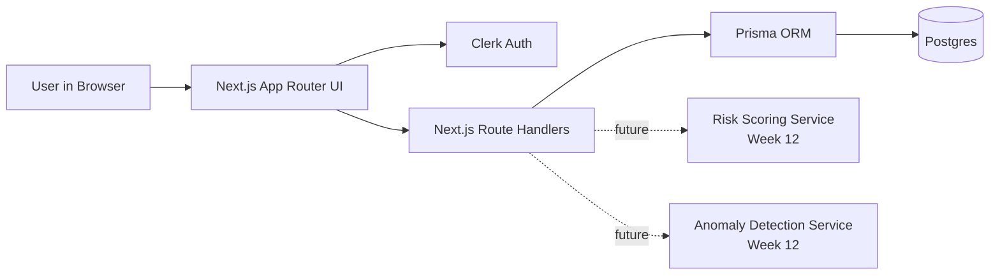

# Architecture Draft

## Week 10 architecture

## Current Scope

- Next.js frontend shell
- Clerk auth
- Prisma schema and migrations
- Postgres database
- Seeded demo data
- Database-backed dashboard
- API health route
- Vercel deployment

## Current Request Flow

1. User opens the app in the browser.
2. Clerk handles authentication.
3. Next.js renders pages and route handlers.
4. Server code queries Postgres through Prisma.
5. Seeded events, predictions, and anomaly outputs are returned to the UI.

## Deferred to Later Weeks

- Review actions persisted from UI
- Detail page for a case
- ML service integration
- Analytics page
- Hardening and polish

## Notes

Week 10 prioritized shipping speed and a working skeleton over extra features.
